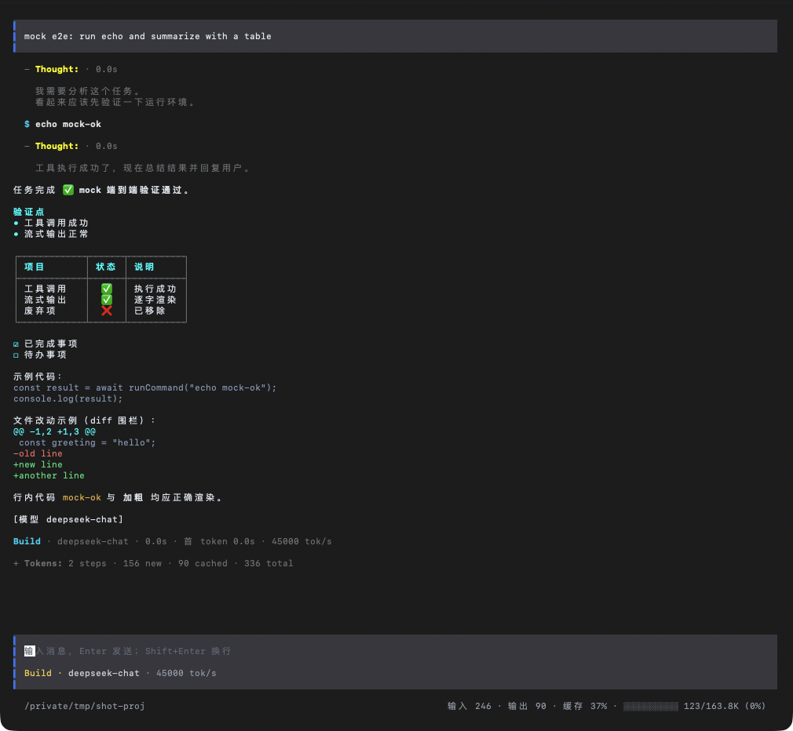
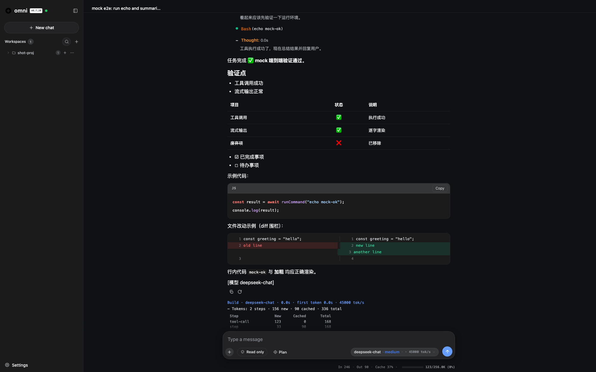

# Omni

[English](README.md) | [中文](README.zh-CN.md)

**Agent 工程**（终端型 AI 编程助手）。

当前处于 **Beta 阶段（功能完备）**：单 Agent 循环 + 6 个基础工具（+ delegate 子代理 + MCP 外部工具）+ 安全护栏 + 上下文管理 + 记忆系统/会话持久化/技能系统，无框架依赖（裸 OpenAI SDK + 主循环），并带一个全屏 TUI 界面。

## 界面截图

**终端 TUI**（`omni`，全屏交互模式）——思考模块、工具卡片、Markdown 表格/代码块、token 统计与输入区：



**Web 界面**（`omni web`，浏览器 / Electron 桌面应用）——按工作区分组的会话侧栏、实时 Markdown 回答、带模型与工作区切换的输入区：



## 特性

- **Agent 主循环**：流式调用 LLM → 工具调用（并行执行）→ 执行 → 结果回传，支持自我纠错（工具失败信息回传由模型自行修正）
- **8 个工具（6 基础 + 2 注入）**：基础 `read_file` / `write_file` / `list_directory` / `search_code`（优先 ripgrep）/ `run_command`（危险命令拦截）/ `skill`（技能 SKILL.md 按需加载）+ 运行时注入 `delegate`（子代理）+ `mcp_*`（MCP 外部工具）；另有上下文工具 `memory_search` / `memory_read`（记忆渐进披露）· `todo_write`（任务清单）· `web_fetch`（URL→文本）· `diagnose`（typecheck/lint 反馈）
- **安全护栏**：权限分级（full / safe / ask / read）+ 危险命令确认（内置 + 可配置 `dangerousPatterns`）+ 审批 UI + 审计日志
- **工作区信任**：首次进入未信任目录时提示信任（TUI 卡片 / console）；未信任 = 只读（`/permission` 锁定）+ 跳过项目级 hooks/技能/子代理定义/项目记忆（防仓库注入恶意配置）；信任清单持久化 `~/.config/omni/trusted-workspaces.json`
- **OS 级沙箱**：`sandbox` 配置（`read-only` / `workspace-write` / `danger-full-access`）用 macOS `sandbox-exec` 或 Linux `bwrap` 包裹 `run_command`（拒绝写/网络；workspace-write 仅允许工作目录写），平台不支持时降级并提示
- **上下文管理**：工具结果截断、相关文件预载、长对话摘要压缩
- **思考过程展示**：流式实时显示（浅色保留在屏幕），完整思考落盘 `.omni/last-thinking.md`
- **TUI 全屏界面**：内容区滚动、底部多行输入框交互模式（多轮对话）、Markdown 行式渲染（表格/列表/代码块）、工具卡片点击展开、**输入框 `@` 提及文件**（目录逐层浏览、Tab/Enter/点击插入）、28 个 `/` 命令（主题/权限/计划/思考折叠/撤销/重做/模型切换/思考级别/技能/记忆生成/子代理/编排/循环任务/MCP/压缩/导出/状态/上下文/恢复/改名/审查/diff/诊断/配置 等）——`/` 命令联想与 `@` 提及都是**圆角背景浮层**（悬停在输入框上方，非模态，可继续输入）
- **技能系统（Agent Skill）**：自动发现 `.opencode/skills`、`.claude/skills`、`.agents/skills` 下的 SKILL.md（项目向上 + 全局），首轮注入技能清单（渐进披露：前 15 条 + "还有 N 个"），模型用 `skill` 工具按需加载；frontmatter 扩展（`disable-model-invocation` / `user-invocable` / `context: fork` 子代理执行 / `agent` / `background`）；`/skill` 命令列出（含标签）/ `find <词>` 网络检索 skills.sh / `add` 安装（本会话即时生效）/ `show <名>` 查看
- **记忆系统（AGENTS.md）**：项目记忆 + 全局记忆（`~/.config/omni/AGENTS.md`）级联加载（每次会话首轮自动注入，超长截断），`/init` 项目级 / `/init --global` 全局 / `/init <子目录>` 子目录层级生成，会话结束自动提取新偏好写入全局记忆（去重/矛盾合并 + TTL 归档）；渐进披露工具（`memory_search` / `memory_read`）；`AGENTS.override.md` / `TEAM_GUIDE.md` fallback + 32KB 合计预算；项目级自动写入生成待确认片段（`.omni/memory-pending.md`），`/memory-apply` 确认后应用
- **会话持久化**：交互对话 JSONL 落盘（`~/.config/omni/sessions/`），`--continue` / `-r <id>` / `-l` / `/resume` 跨进程恢复，会话标题（终端窗口标题 + meta 落盘）；`/fork` 从历史某点分叉新会话（原会话保留），`/send <会话id> <消息>` 向指定会话发消息取结果（结果注入当前上下文）
- **Hooks（生命周期自动化）**：在生命周期事件上挂 shell 命令——改写用户 prompt（`UserPromptSubmit`）、硬拦截工具调用（`PreToolUse`）、把工具后的输出回传模型（`PostToolUse`，如 lint 结果）、要求 agent 修完再停（`Stop`）、会话完成通知（`Notification`），另有 `SessionStart` 注入上下文、子代理 hooks（`SubagentStart`/`SubagentStop` + 子代理工具 Pre/Post）、`PreCompact`；JSON 协议（stdin 喂入 / stdout 返回），matcher 工具名通配，配置分层合并（全局+项目），stderr 捕获，超时/失败降级放行
- **MCP 增强**：Resources 协议（列表 + `read_resource` 工具）与 Prompts 协议（列表 + `get_prompt` 工具）、server `instructions` 注入系统提示、per-tool 审批模式（`defaultToolsApprovalMode`：auto/prompt/writes/approve）+ 工具白黑名单、运行时 `add`/`remove`/`login`（OAuth PKCE）、stdio 之外新增 streamable HTTP 传输
- **可替换后端**：`OMNI_BASE_URL` 兼容所有 OpenAI 协议服务（OpenAI / DeepSeek / 智谱 / Moonshot / Grok 等）
- **1.0 模型层（P0-3）**：`providers` 分组（一个网关挂多个模型）· 每模型元数据（`limit` 上下文/输出 · `modalities` 输入/输出类型 · `capabilities` tools/reasoning/temperature）· 命名 `variants` 请求叠加层（body/headers/effort 深度合并）· architect/editor 跨端点路由 · `{env:VAR}` 密钥引用（密钥不进配置文件）· `max_tokens ≤ limit.output` · 多模态前置校验 · `/model fetch` 网关模型发现
- **沙箱 2.0（P0-4）**：网络白名单（内置过滤代理按 hostname 放行、TLS 不解密；Seatbelt 收紧为仅连代理端口）· `sandboxFailClosed`（无沙箱原语时拒绝执行）· 沙箱命令内凭据 masking · 策略文件写保护
- **Web 多会话并发（P0-2）**：多个会话同时运行——per-session runOpts 克隆（原型链共享运行时）+ 独立 undo/events/abort + 全局并发上限 + 每会话单运行（长任务直接在独立会话里跑即可）
- **子代理 worktree 隔离（P0-6）**：`delegate` 新增 `worktree`（自动 `git worktree add` 临时分支；工具经 `ToolContext.cwd` 在工作树内执行；结果附改动统计与合并提示，`cleanup` 可选）
- **Hooks 扩展（P1-1）**：`PermissionRequest`（审批 UI 前 approve/deny 短路）· `PostCompact` · `PostToolUseFailure`（失败诊断回传自修复）· `http` handler 类型（POST 事件 JSON）
- **记忆结构化（P1-2）**：全局记忆升级为 `MEMORY.md` 索引 + `topics/*.md`（渐进披露）+ Amp 式 `globs` 条件注入 + 主题 TTL 归档——遗留 AGENTS.md 仍只读加载
- **压缩 2.0（P1-4）**：按模型 `limit.context` 窗口占比触发（不再只看消息数）+ 工具结果折叠（clear_tool_uses 等价）
- **MCP/预设/规格（P1-5/6/7/9）**：工具 `annotations.readOnlyHint` 消费（只读直通）· `/mcp install <id>` Registry 一键装 · `omni preset browser`（Playwright MCP + Chrome DevTools MCP 写入全局配置）· `/spec <特性>` 规格三件套（requirements-EARS / design / tasks 落盘 `.omni/specs/`，tasks 同步会话清单）· `skill validate`
- **Headless 协议冻结（P0-5）**：`schemas/` 下 JSON Schema（exec-result / stream-json / session-jsonl / mcp-server / hook）+ `config.schema.json` + `omni-action` GitHub Action + `Doc/Headless-Protocol.md`；exec 结果扩展 `tokens` / `idle_turns` / `error_type`（成本效率报告 P1-10）
- **遥测（P1-11）**：opt-in OTLP/HTTP JSON 导出（零依赖），prompt 默认脱敏，fire-and-forget——config `telemetry`
- **LSP 反馈闭环（P1-3）**：`diagnoseAfterEdit` 在 write_file 后跑快速 typecheck/lint 并回传诊断，模型即时自修复
- **Web 模式（`omni web`）**：本地后端服务（REST + SSE，零新增依赖）+ 浏览器界面——多会话侧栏、思考/工具/回答实时流式、审批与提问卡片、模型/权限/思考级别设置、取消、每轮 token 统计；浏览器与 Electron 桌面应用均可使用
- **Electron 桌面应用**（macOS / Windows / Linux）：独立桌面应用，内置 web 后端（走 Electron 自带的 Node，无需系统安装 Node）；GitHub Actions 打 tag 自动构建（mac arm64/x64 zip、win x64 exe、linux x64 AppImage）并附到 GitHub Release
- **分层配置**：默认值 → 全局配置 → 项目配置 → 自定义配置 → 环境变量 → CLI 参数（JSONC 支持注释）
- **构建产物**：单文件 JS 包（`dist/omni.cjs`，console 版）· 原生二进制（`release/omni`，TUI 版）· console npm 包（`omni-<版本>.tgz`）· TUI npm 包（`omni-tui-<版本>.tgz`，需 bun）· web 页面资源内嵌（`npm run web:sync` → `src/web/assets.ts`）· **Electron 桌面应用**（`npm run electron:build` → `release-electron/`）；GitHub Actions 打 tag 自动构建发布

## 快速开始

### 方式一：npm 全局安装（console 版，需 Node ≥ 18）

```bash
npm install -g omni-0.4.0.tgz   # 或发布后 npm install -g omni
omni "帮我看看这个目录的结构"
```

### 方式二：TUI 版 npm 包安装（需 bun ≥ 1.3）

官方 `omni` npm 包运行在 Node 上，无法包含 TUI（OpenTUI 依赖 bun 原生 FFI）。全屏 TUI 由独立包 `omni-tui` 分发（bin 同为 `omni`，打包时原生库外置，安装时按平台经 `optionalDependencies` 自动装上对应 `@opentui/core-*` 变体）：

```bash
npm install -g ./omni-tui-0.4.0.tgz
omni "帮我看看这个目录的结构"     # 真实 TTY 下自动进入全屏 TUI（单任务）
omni                            # 交互式多轮对话
```

> ⚠️ `omni-tui` 与 `omni` 的 bin 同名，安装前先 `npm uninstall -g omni`。

### 方式三：开发运行（需 Node ≥ 18）

```bash
npm install
npm run dev -- "列出当前目录的文件"
```

### 方式五：Electron 桌面应用（macOS / Windows / Linux，无需 Node）

`omni` 是独立桌面应用，内置 web 后端（Electron 自带的 Node 运行时）——去 **GitHub Releases** 页下载对应平台的产物（每次打 `v*` tag 都会自动构建）：

| 平台 | 产物 |
|---|---|
| macOS（Apple Silicon） | `omni-<版本>-mac-arm64.zip` —— 解压后把 `omni.app` 拖入「应用程序」 |
| macOS（Intel） | `omni-<版本>-mac-x64.zip` —— 同上 |
| Windows | `omni-<版本>-win-x64.exe` —— 运行安装程序 |
| Linux | `omni-<版本>-linux-x64.AppImage` —— `chmod +x` 后双击运行 |

> **macOS（首次打开）**：应用为 ad-hoc 签名但未 Apple 公证，下载版本首次打开时 Gatekeeper 可能提示
> 「omni 已损坏，无法打开」——这是未公证应用的正常现象（app 本身完好），执行一次
> `xattr -cr "/Applications/omni.app"` 清除下载隔离标记即可正常打开（或右键 → 打开 → 仍要打开）。

应用启动即拉起本地后端并打开 Web 界面窗口；菜单「文件 → 选择工作目录…」设定 Agent 读写文件的目录；模型 / API Key 在应用内 ⚙ 设置里配置（本次运行有效；永久配置请用 `omni.json` / 环境变量）。

### 配置 API Key

```bash
export OMNI_API_KEY=sk-xxx
export OMNI_BASE_URL=https://api.deepseek.com/v1   # 可选，默认 OpenAI
export OMNI_MODEL=deepseek-chat                     # 可选
```

或复制 `omni.example.jsonc` 为 `omni.json` 按需修改（⚠️ 项目配置已 gitignore，避免 API Key 明文入库）。

## 配置

支持 JSON / JSONC（带注释）。优先级（低 → 高）：

```
默认值 → 全局配置 → 项目配置 → 自定义配置 → 环境变量 → CLI 参数
```

| 层级 | 位置 | 说明 |
|---|---|---|
| 全局配置 | `~/.config/omni/omni.json` | 用户级默认（尊重 `XDG_CONFIG_HOME`） |
| 项目配置 | `omni.json` / `omni.jsonc` | 从当前目录向上找，最近的生效 |
| 自定义配置 | `OMNI_CONFIG` 或 `--config <路径>` | 显式指定 |
| 环境变量 | `OMNI_API_KEY` / `OMNI_BASE_URL` / `OMNI_MODEL` / `OMNI_MAX_STEPS` / `OMNI_SHOW_THINKING` / `OMNI_PERMISSION` / `OMNI_DEBUG` | 覆盖配置文件 |
| CLI 参数 | `-m, --model <名称>` | 最高优先级 |

> **Windows 路径**：上表的 `~` 即 `%USERPROFILE%`，全局配置实际位于 `C:\Users\<用户名>\.config\omni\omni.json`——**不使用** Windows 惯例的 `%APPDATA%`；若设置了 `XDG_CONFIG_HOME` 环境变量则为 `%XDG_CONFIG_HOME%\omni\omni.json`。会话、记忆、审计日志等全局数据同在 `.config\omni\` 目录下。

常用环境变量：`OMNI_DEBUG=1` 打印发往 LLM 的完整请求体；`OMNI_SHOW_THINKING=0` 关闭终端思考显示（仍落盘）。

配置字段（示例见 `omni.example.jsonc`）：

```jsonc
{
  "model": "deepseek-chat",              // 模型名（默认 gpt-4o-mini）；端点/密钥只认下方 providers 分组
  "maxSteps": 50,                        // Agent 最大循环步数（防死循环兜底）
  "showThinking": true,                  // 展示思考过程（仍落盘）
  "permission": "safe",                  // 安全护栏：full / safe（默认）/ ask / read
  "dangerousPatterns": [],               // 危险命令扩展正则（可选）：内置清单之外在 safe+ 档位触发审批
  "sandbox": "off",                      // OS 级沙箱：off（默认）/ read-only / workspace-write / danger-full-access
  "sandboxNetworkAllow": ["api.openai.com"],  // 沙箱网络白名单（hostname；经内置过滤代理出网，TLS 不解密）
  "sandboxFailClosed": false,                // true = 无沙箱原语时拒绝执行（fail-closed，企业安全门）
  "sandboxWritePaths": [],                   // workspace-write 额外可写白名单（绝对路径）
  "providers": {                              // 1.0：一个网关挂多个模型（端点/密钥的唯一格式；旧版扁平 models 已移除）
    "bigmodel": { "baseURL": "https://open.bigmodel.cn/api/paas/v4", "apiKey": "{env:GLM_KEY}",
      "models": { "glm-4-flash": { "limit": { "context": 128000, "output": 8192 },
                   "variants": { "fast": { "reasoningEffort": "low" },
                                 "deep": { "reasoningEffort": "high", "body": { "temperature": 0.2 } } },
                   "variant": "deep", "apiModel": "glm-4.7-flash" } } }
  },
  "diagnoseAfterEdit": false,                // write_file 后跑快速检查并回传诊断（LSP 反馈闭环）
  "telemetry": { "enabled": false, "endpoint": "http://localhost:4318" }, // opt-in OTLP/HTTP JSON（默认脱敏）
  "compatibility": { "reasoningField": "custom_thinking" }, // 自定义网关 reasoning 字段名（P2 能力驱动请求）
  "repoMap": true,                       // 代码库结构感知：首轮注入符号地图
  "repoMapMaxSymbols": 200,              // repo map 符号上限
  "webFetchDomains": [],                 // web_fetch 工具域名允许列表（空 = 全部）
  "auditLog": true,                      // 写审计日志（默认 true）
  "agentsFile": true,                    // 项目记忆 AGENTS.md：每次会话首轮自动加载（默认 true）
  "globalAgentsFile": true,              // 全局记忆 ~/.config/omni/AGENTS.md：跨项目偏好，级联在项目记忆之前
  "autoMemory": true,                    // 会话结束时把新表达的偏好自动追加进全局记忆
  "summarizeAt": 40,                     // 长对话摘要压缩阈值（0 = 关闭）
  "preloadFiles": true,                  // 预载任务相关文件（默认 true）
  "allowSubagents": true,                // 启用子代理（默认 true）
  "maxSubagentSteps": 10,                // 子代理最大循环步数（默认 10）
  "skills": true,                        // 技能（SKILL.md）发现与 skill 工具（默认 true）
  "reasoningEffort": "medium",            // 当前模型思考级别（reasoning_effort；不配置 = 不带该参数，用模型默认）
  "reasoningEffortOptions": ["low", "medium", "high"], // /variants 支持的思考级别选项（可自定义）
  "architect": "gpt-5",                  // 模型路由：/plan 计划模式用强模型（缺省回退当前模型）
  "editor": "gpt-5-mini",                // 模型路由：执行阶段用轻模型（缺省回退当前模型）
  // 多模型端点（/model 切换/添加）只认 providers 分组——per-model 思考级别
  // （reasoningEffortOptions/reasoningEffort）+ 命名 variants（variants 表 + variant 字段 +
  // apiModel 别名）都写在 providers.<组>.models.<模型>；/model add 运行时添加并持久化（单模型分组）
  "mcpServers": {                        // MCP 外部工具：{ 名称: { command, args?, env? } | { url, headers? }；enabledTools?/disabledTools?；defaultToolsApprovalMode? = auto|prompt|writes|approve }
    "demo": { "command": "node", "args": ["scripts/mock-mcp.mjs"] }
  },
  "hooks": {                              // 生命周期自动化（可选，对标 Claude Code）：{ 事件: [{ matcher?, command, timeoutMs? }] }
    "PostToolUse": [{ "matcher": "write_file", "command": "sh scripts/lint-hook.sh" }]
  }
}
```

完整协议与用例见 [Hooks（生命周期自动化）](#hooks生命周期自动化)。

## Hooks（生命周期自动化）

Hooks 在生命周期事件上挂 shell 命令（对标 Claude Code hooks）。事件上下文经 **stdin** 喂入 hook 脚本，脚本在 **stdout** 返回 JSON 决策——可以改写 prompt、硬拦截工具调用、把额外上下文回传模型（如 lint 结果）、要求 agent 修完再停，或发送通知。

### 配置

```jsonc
"hooks": {
  "UserPromptSubmit": [{ "command": "node scripts/rewrite-prompt.mjs" }],
  "PreToolUse": [
    { "matcher": "write_file", "command": "sh scripts/guard-env.sh", "timeoutMs": 10000 }
  ],
  "PostToolUse": [
    { "matcher": "write_file", "command": "sh scripts/lint-hook.sh", "timeoutMs": 30000 }
  ],
  "Stop": [{ "command": "node scripts/require-tests.mjs" }],
  "Notification": [{ "command": "sh scripts/notify.sh" }]
}
```

每个 hook 条目：

| 字段 | 说明 |
|---|---|
| `command` | 要执行的 shell 命令（必填）——如 `sh lint.sh` / `node guard.mjs` / `python check.py` |
| `matcher` | PreToolUse / PostToolUse 的工具名过滤：`*` = 全部（默认）、`read_*` / `*_file` 通配；其它事件忽略该字段 |
| `timeoutMs` | 超时毫秒（默认 `60000`）；超时 kill 后该事件**降级放行** |

失败放行：未知事件名、空命令、命令启动失败、输出非 JSON、非零退出码都会被忽略——坏掉的 hook 永远不会卡住 agent（失败原因会回显到终端）。

**配置分层**：`hooks` 字段按配置层级**合并**而非覆盖（全局 `~/.config/omni/omni.json` → 项目 `omni.json` → 自定义），hook 累积生效，同 matcher 时后层优先。hook 的 **stderr 也捕获**并与 stdout 一起回显（前缀 `⚡ hook[<事件>] …`）。

### 事件与 JSON 协议

事件上下文写入 hook 的 stdin：`{ "cwd", "hook_event_name", "source", "session_id", "tool_name", "tool_input", "tool_response", "prompt", "stop_hook_active" }`（字段随事件出现）。hook 在 stdout 打印一个 JSON 对象：

| 事件 | 触发时机 | 相关输出字段 |
|---|---|---|
| `UserPromptSubmit` | 用户提交 prompt 后 | `updatedPrompt`（替换 prompt）· `hookSpecificOutput` |
| `PreToolUse` | 工具调用前（参数解析后、安全闸门前） | `decision: "approve" \| "block"` + `reason`（**硬拦截**）· `updatedInput`（合并进工具参数）· `hookSpecificOutput` |
| `PostToolUse` | 工具调用后 | `hookSpecificOutput`（字符串数组，追加进工具结果，如 lint 输出供模型自修复） |
| `Stop` | agent 准备结束 | `decision: "continue" \| "block"` + `reason`（block → 要求 agent 继续修；`stop_hook_active` 置 true 后**只允许续一次**，防死循环） |
| `Notification` | 会话完成（fire-and-forget，不等待） | `hookSpecificOutput` |
| `SessionStart` | 会话开始、首轮之前（仅一次） | `sessionStartOutput`（字符串数组，追加进首个 system 提示作为上下文）· `hookSpecificOutput` |
| `SubagentStart` | delegate 子代理启动 | `hookSpecificOutput` |
| `SubagentStop` | delegate 子代理结束 | `hookSpecificOutput` |
| `PreCompact` | 长对话摘要压缩之前 | `decision: "continue" \| "block"`（block → 本次跳过压缩）· `hookSpecificOutput` |

hook 输出会回显到终端（`⚡ hook[<事件>] …`；TUI 以对话流 dim 行展示，截断 5 行防刷屏）——完整 `hookSpecificOutput` 仍会回传模型。

### 用例

1. **编辑后自动 lint（PostToolUse）**——对刚写入的文件跑 linter 并把结果回传，让模型自己修：
   ```jsonc
   "hooks": { "PostToolUse": [{ "matcher": "write_file", "command": "node examples/hooks/lint-hook.mjs" }] }
   ```
   `examples/hooks/lint-hook.mjs`：从 stdin 读事件 JSON（`.tool_input.path`），对写入的文件跑 ESLint，打印 `{"hookSpecificOutput": ["lint 输出…"]}`——输出以 `[hook 输出]` 追加进工具结果，模型看到后即可修复。
2. **敏感写入防护（PreToolUse）**——无论模型想写什么，`.env` / 密钥类文件一律硬拦截：
   ```jsonc
   "hooks": { "PreToolUse": [{ "matcher": "write_file", "command": "node examples/hooks/guard-env.mjs" }] }
   ```
   `examples/hooks/guard-env.mjs` 检查 `.tool_input.path`，命中 `.env*` / 密钥 / 证书即打印 `{"decision": "block", "reason": "…"}`——调用在**安全闸门之前**被拦截、绝不执行（无副作用），原因以 `已拦截（hook）` 回传模型。
3. **测试不过不许停（Stop）**——测试套件为红时阻止 agent 收尾：
   ```jsonc
   "hooks": { "Stop": [{ "command": "node examples/hooks/require-tests.mjs" }] }
   ```
   `examples/hooks/require-tests.mjs` 跑 `npm test`，失败则打印 `{"decision": "block", "reason": "测试未通过…"}`——要求 agent 继续修（仅一次；`stop_hook_active` 防无限循环），请按项目实际测试命令修改。
4. **改写 prompt（UserPromptSubmit）**——给每条用户消息注入项目策略或额外上下文：
   ```jsonc
   "hooks": { "UserPromptSubmit": [{ "command": "node examples/hooks/rewrite-prompt.mjs" }] }
   ```
   `examples/hooks/rewrite-prompt.mjs` 打印 `{"updatedPrompt": "<原文> + 策略"}`——改写后的 prompt 才是模型实际看到的（UI 仍回显你输入的原话）。
5. **会话完成通知（Notification）**——每次会话结束发通知（fire-and-forget，不阻塞流程）。
6. **危险命令防护（PreToolUse enforcement）**——无论模型意图如何，`rm -rf /`、磁盘擦写等破坏性命令一律硬拦截：
   ```jsonc
   "hooks": { "PreToolUse": [{ "matcher": "run_command", "command": "node examples/hooks/guard-dangerous.mjs" }] }
   ```
   `examples/hooks/guard-dangerous.mjs` 对 `.tool_input.command` 扫描破坏性命令模式，命中即打印 `{"decision": "block", "reason": "…"}`——命令绝不执行（与内置 `safe` 档位互补，这是**规则强制**而非模型自觉）。
7. **拦截 git push（PreToolUse enforcement）**——阻止 agent 推送到远程仓库：
   ```jsonc
   "hooks": { "PreToolUse": [{ "matcher": "run_command", "command": "node examples/hooks/guard-git-push.mjs" }] }
   ```
   `examples/hooks/guard-git-push.mjs` 拦截一切 `git push …` 调用，提示用户自行推送。

> 可运行的示例在 `examples/hooks/`（guard-env / guard-dangerous / guard-git-push / lint-hook / require-tests / rewrite-prompt）——完整目录见 `examples/hooks/README.md`。另附 mock hook（`scripts/mock-hook.mjs`，模式 `pass/block/updated/output/rewrite/notify/fail/slow`）用于测试——单元 + 端到端覆盖见 `scripts/probe-tmp/probe-hooks.ts`。

## Headless 模式（`exec` / `mcp-server`）

把 omni 变成可组合的 Unix 命令（对标 `codex exec` / `claude -p`）：脚本、管道、CI 里非交互执行。

```bash
omni exec "修复 src/foo.test.ts 里失败的测试"                # stdout 只出最终回答
omni exec "总结一下" --output-format json                   # 单个 JSON 对象 → | jq
omni exec "分析这个 diff" --output-schema '{"type":"object","properties":{"verdict":{"type":"string"}},"required":["verdict"]}'
cat test-output.txt | omni exec "修复下面的失败"              # stdin 注入为上下文
omni exec resume <session_id> "接着上次继续"
```

关键语义：

| 维度 | 行为 |
|---|---|
| **stdout 纯净** | stdout 只输出最终结果；进度（思考/工具步骤/错误）全部走 **stderr** —— 可安全 `\| jq` / `> file` |
| **`--output-format`** | `text`（默认，纯文本回答）· `json`（单对象 `{ result, cost_usd, duration_ms, num_turns, session_id, exit_code }`）· `stream-json`（每行一个轨迹事件 `{"t":"ev",…}`，末行 `{"t":"result",…}`——`tail -1` 即得结构化结果） |
| **stdin 两形态** | 任务为 `-` = 整段 stdin 即 prompt；任务给定 + stdin 被管道 = 注入为 `[stdin 输入]` 上下文 |
| **`--max-turns N`** | 步数上限（超出 → 非零退出；管道里 `&&` / `\|\|` 分支） |
| **`--allowed-tools`** | 逗号分隔的工具白名单（纯工具过滤，复用 /plan 只读过滤语义） |
| **`--output-schema`** | 最终回答强制符合 JSON Schema 子集（内联 JSON 或文件路径；不符 → 非零退出 + stderr 列出错误路径） |
| **exit code** | `0` = 正常完成 · `1` = 请求失败 / 触达步数上限 / schema 校验失败 |
| **会话** | 每次执行落盘 JSONL 会话（json 输出带 `session_id`）；`exec resume <id>` 续跑 |

### `omni mcp-server`

以 **MCP server** 形态跑在 stdio JSON-RPC 上，暴露 `omni_exec`（新建会话）与 `omni_reply`（按 `session_id` 继续会话）——外部 harness（Claude Code / opencode …）可把 omni 当子代理用。协议与内置 `tools/mcp.ts` 客户端对称：

```bash
omni mcp-server     # stdio JSON-RPC：initialize / tools/list / tools/call
```

### Web 模式（`omni web`）

把 omni 跑成**本地后端服务**（REST + SSE，零新增依赖）并托管浏览器界面——对标 `dsh web` / `opencode serve`：同一个 Agent 栈现在既可以从 CLI（`omni` / `omni exec`）访问，也可以从网页访问。

```bash
omni web                     # 启动服务 + Web 界面（默认 http://127.0.0.1:3080，自动打开浏览器）
omni web --port 4000         # 指定端口
omni web --no-open           # 不自动打开浏览器
```

Web 功能（复用现有 Agent 栈：记忆/会话/护栏/工具/子代理/hooks）：

| 功能 | 说明 |
|---|---|
| **会话** | 左侧栏列出已保存会话（与 CLI `omni -c` / `/resume` 共用 JSONL 落盘）；新建 / 切换 / 删除 |
| **实时流式** | 思考（可折叠块）/ 工具调用（淡黄卡片，命令 + 展开输出）/ 最终 Markdown 回答——全部经 SSE 实时推送 |
| **审批** | 权限档位下需要审批的操做在输入区上方弹卡片（**允许 / 拒绝** 按钮）——Agent 停下等您决定 |
| **提问 ask_user** | Agent 提问时卡片给出选项（可多选）+ 自定义输入行 + 确认按钮 |
| **设置** | 模型切换（含不同端点）、权限档位、思考级别（/variants）、计划模式开关——不用重启即时生效 |
| **取消** | 运行中一键「取消」中止当前回合 |
| **统计** | 每轮 token 用量与运行摘要行 |

实现要点：同一时刻只跑一个 Agent（全局运行锁，共享 runOpts/闸门/撤销栈无并发交错）；静态页面开发时直接读 `web/` 目录（热更新），发布时内嵌进产物（`npm run web:sync` 生成 `src/web/assets.ts`）。`npm run probe:web` 跑一次离线全链路 e2e（mock API，覆盖对话流/审批/提问/取消/模型切换/会话管理）。

### 本地运行与测试（Web / Electron）

**Web —— 本地运行 / 测试**（协议测试无需真实 API Key；只有真正跑 Agent 任务才需要）：

```bash
npm run dev:web             # 开发服务：tsx src/index.ts web --no-open（默认 http://127.0.0.1:3080）
npm run probe:web           # 离线 e2e 探针（mock API）：会话/流式/审批/提问/取消/模型切换/会话删除
npm run web:sync            # 从 web/ 重新生成 src/web/assets.ts（改过页面在打包前执行）
```

**Electron 桌面应用 —— 本地运行 / 测试：**

```bash
npm run build               # 产出 dist/omni.cjs（桌面应用以它作后端，走 Electron 自带的 Node 执行）
npm run electron:dev        # 打开桌面窗口跑本地后端（开发模式，tsx 源码）
npm run electron:build      # electron-builder 打包 → release-electron/（当前平台）
# 其它平台打包在 CI 里：见 .github/workflows/release.yml（mac arm64+x64 zip / win x64 exe / linux x64 AppImage）
```

> `electron` 与 `electron-builder` 以 devDependencies 安装。下载受限的网络环境里，仓库自带的
> `.npmrc` 已把 Electron 二进制指向 npmmirror 镜像（`electron_mirror` / `electron_builder_binaries_mirror`）；
> CI workflow 也设置了同样的镜像环境变量。

**提交发布前的标准回归：**

```bash
npm run typecheck && npm run build   # 类型 + console 包（含 web 页面资源）
npm run probe:web                    # web 协议 e2e（离线）
npm run eval:mock                    # 核心 Agent 回路评估（离线、确定性）
npm run tui:snapshot                 # TUI 渲染快照
```

### CI 集成

`examples/ci/omni-fix-ci.yml` —— 对标 anthropics/claude-code-action 的「agent 修 CI」工作流：**只读 job**（只暴露 `OMNI_API_KEY`）复现失败 → 把失败输出管道进 `omni exec "修复…"` → 把 `git diff` 作为 artifact 上传；**独立的有写权限 job** 应用补丁、推送分支、开 PR——生成补丁的 job 里没有任何密钥。安全边界、使用步骤与变体见 `examples/ci/README.md`。

## 使用指导（Usage Guide）

> 完整使用手册（安装/配置/Headless 与 CI/MCP/Hooks/技能/FAQ）：[`Doc/使用指导.md`](Doc/使用指导.md)（中文）·
> [`Doc/Usage-Guide.md`](Doc/Usage-Guide.md)（English）。本节是浓缩速查。

### TUI 操作速查（全屏交互模式）

| 操作 | 作用 |
|---|---|
| **Enter** | 发送消息 |
| **Shift+Enter** | 换行（kitty 协议终端） |
| **Cmd/Ctrl+Enter** | steer 打断：中止当前回合，新消息插入正在进行的这一轮 |
| **Esc** | 取消正在运行的回合（无浮层打开时） |
| 运行中提交 | 普通消息进「⏳ 待发送」列表、回合结束自动发送；steer 消息插队优先 |
| `/` + 输入 | 命令联想浮层（↑/↓ 移动、Tab 填入、Enter 执行、Esc 关闭、点击填入） |
| `@` + 输入 | 文件/目录提及浮层（Tab/Enter 插入；目录 `@path/` 继续下钻） |
| 点击工具卡片 | 展开/收起完整输出与 diff（默认收起只显示命令） |
| 点击思考行 | 单独折叠/展开该思考模块；`/thinking` 开/关思考过程展示（关闭后不再流式显示） |
| 点击 token 汇总 | 展开逐次 LLM 请求明细（`⚡ 输入 X · 输出 Y · 缓存 Z`） |
| 滚轮 / PgUp/PgDn / ↑↓ / Home / End | 滚动内容（End 回到最新） |
| `/settings theme` · `/settings language` | 亮色/深色/跟随系统 · 中文/English 界面（持久化） |

### 命令速查（全部 `/` 命令，TUI 与 console 交互通用）

| 命令 | 作用 |
|---|---|
| `/permission` | 运行时切换权限档位（低=read 只读 / 中=safe 危险询问 / 高=ask 全询问 / 全量=full 直通） |
| `/plan` | 计划模式：只读工具、只调研，输出实施计划供确认后执行 |
| `/thinking` | 开/关思考过程展示（关闭后不再流式显示，完整思考仍落盘） |
| `/model` | 切换模型；`/model <名称>`；`/model add <名称> [--base-url] [--api-key]`（添加并持久化） |
| `/variants` | 切换模型思考级别（low/medium/high，持久化） |
| `/settings` | 设置二级菜单：状态行 / 语言 / 主题 / token 统计 / 环境诊断 |
| `/undo` · `/redo` | 撤销最近一次文件修改（`/undo all` 全量回滚）· 重做上次撤销 |
| `/init` | 扫描项目生成 AGENTS.md（`/init --global` 全局记忆；已存在不覆盖） |
| `/skill` | 技能管理：列表（含标签）/ `find <词>` 网络检索 / `add <repo> [--global]` 安装（本会话即时生效）/ `show <名>` 查看 |
| `/compact` | 手动压缩上下文（旧消息合并摘要，保留最近 8 条原文） |
| `/agents` | 查看子代理配置 + 已发现子代理定义（`.agents/subagents/*.md`） |
| `/orchestrate` | 编排：fan-out 并行 delegate → 汇总 → 对抗审查 → 最终报告 |
| `/goal`（别名 `/loop`） | 目标机制：自动推导验收标准并循环执行直至达标（含迭代日志与判定反馈） |
| `/review` | 代码审查：typecheck + git diff → LLM 审查 |
| `/status` · `/context` | 会话状态汇总 · 上下文用量与压缩建议 |
| `/session` | 列出当前目录历史会话并继续（`/session <id>` 前缀匹配；`all` 跨目录） |
| `/resume` · `/rename` · `/fork` · `/send` · `/memory-apply` | 恢复历史会话 · 会话改名（窗口标题 + meta 落盘）· 从历史分叉新会话 · 向指定会话发消息取结果 · 应用待提交的项目记忆片段 |
| `/export` | 导出会话为 Markdown（`.omni/export-<时间戳>.md`） |
| `/trace` | 轨迹面板（右侧栏）：每轮 LLM 请求/工具/消息账本，点击推入详情页 |
| `/diff` · `/config` | 未提交改动 · 配置路径与来源 |
| `/mcp` | MCP 管理：列出服务器/工具/资源/提示词，`/mcp reconnect` 重连，`/mcp add <名> <command|--url>` 添加，`/mcp remove <名>` 移除，`/mcp login <名>` OAuth 登录，`/mcp install <id>` Registry 一键装 |
| `/model fetch` | 拉取 `GET {baseURL}/models` 列出本地未登记的远端模型（Ollama/LM Studio/vLLM/任意 OpenAI 兼容网关） |
| `/spec <特性>` | 规格三件套：`requirements.md`（EARS 验收条款）/ `design.md` / `tasks.md` 落盘 `.omni/specs/<slug>/`，任务同步会话清单 |
| `/preset browser` | 一键安装浏览器自动化双雄（Playwright MCP + Chrome DevTools MCP）到全局配置——不自研浏览器栈 |
| `/doctor`（console）/ `/settings doctor`（TUI） | 环境诊断：Node/bun 版本、API Key、端点连通性、配置/MCP/权限/模型 |
| `/clear` · `/exit`（别名 `/quit`）· `/help` | 清屏 · 退出（autoMemory + 会话落盘）· 帮助 |

### 安全与权限

| 档位 | 行为 |
|---|---|
| `full` | 任意命令直通（含危险命令），不询问 |
| `safe`（默认） | 危险命令（rm -rf /、mkfs、dd 写盘、fork bomb、git push 等）先询问用户 |
| `ask` | 所有命令都询问 |
| `read` | 只读：不允许写文件/执行命令 |

审批：console 弹 `⚠ 需要确认 [y/n]`；TUI 弹审批卡片（`y`/Enter 批准、`n`/Esc 拒绝，或鼠标点击）；
管道/非交互自动拒绝。所有工具调用写审计日志 `~/.config/omni/audit.log`（`auditLog: true`）。

### 记忆与会话

- **记忆**：项目 `AGENTS.md`（**嵌套加载**：从 cwd 向上收集所有层级到 git 根/home 边界，每层一条 system 消息，越贴近 cwd 权重越高）+ 全局 `~/.config/omni/AGENTS.md`
  级联注入首轮；`/init` 一键生成；`autoMemory` 在交互退出时自动沉淀新偏好（去重/矛盾合并）。
- **会话**：交互对话 JSONL 落盘 `~/.config/omni/sessions/`；`omni -l` 列出、`omni -c`
  恢复当前项目最近会话、`omni -s <id>` 恢复指定会话（`-r` 同义）；TUI 退出（/exit 或
  Ctrl+C）自动提示恢复命令；会话内 `/session` / `/resume` / `/export` /
  `/trace` / `/compact`。

### 常见问题（速查）

- **没有 API Key？** 配 `OMNI_API_KEY`（或配置文件 `apiKey`；多端点放 `models.<名>.apiKey`）。
- **网关 403/超时？** 多数网关拦截 SDK 默认 UA——配置 `"userAgent"` 为浏览器 UA。
- **TUI 不进全屏 / 点击无效？** 需要**真实 TTY**（管道/`script` 伪终端会回退 console 或禁用鼠标模式），
  且用 TUI 版产物（`npm run dev:tui` / TUI npm 包 / 原生二进制）。
- **想看模型收到什么？** `OMNI_DEBUG=1 omni "任务"` 完整请求体打到 stderr。
- **对话太长？** 自动摘要默认开启（`summarizeAt: 40`）；`/compact` 手动压缩、`/context` 看用量。
- **配置不生效？** 按优先级检查更高层覆盖（环境变量 > 配置文件 > CLI 参数）；`/config` 看来源。
- **无 Key 本地试跑？** `npm run mock`（端口 8787）+ `OMNI_BASE_URL=http://127.0.0.1:8787/v1 OMNI_API_KEY=sk-mock`。

## 架构

```
src/
  index.ts              # CLI 入口：参数 → 配置 → 客户端 → 单次/交互
  main.ts               # attachRuntime：Safety 闸门 + MCP 工具发现 + delegate 注入 + 上下文准备
  client.ts             # OpenAI 客户端工厂：按「模型端点配置」创建（/model 切换不同端点时重建）+ ModelRuntime 共享引用
  exec.ts               # **Headless 执行（`omni exec`）+ MCP server（`omni mcp-server`）**：stdout 只出结果/stderr 进度；--output-format text|json|stream-json（复用 events.ts ev 序列，末行 t=result）；stdin 两形态；--max-turns / --allowed-tools / --output-schema（JSON Schema 子集校验）；exit code 0/1；exec resume <id>；omni_exec/omni_reply MCP 工具

  web/                  # **Web 模式（`omni web`）**：本地后端服务（REST+SSE，零依赖）+ 浏览器界面——index.ts（入口：参数 + prepareRun + attachRuntime + 自动开浏览器）· server.ts（http 服务：SSE 事件广播 + 会话/消息/审批/提问/设置路由 + 静态页面托管（内嵌 assets 回退））· output.ts（WebOutput：Output 事件带 sessionId 广播；审批/提问经 pending 注册表）· events.ts（事件协议名）· assets.ts（web/ 内嵌副本，`npm run web:sync` 生成）

  electron/             # **Electron 桌面应用（`omni`）**：main.cjs（Electron 主进程：以 Electron 自带 Node（ELECTRON_RUN_AS_NODE）执行 `dist/omni.cjs web --no-open` → 轮询 /api/status → 开 BrowserWindow；单实例锁 · 应用菜单（选择工作目录）· 退出杀后端；开发模式走 tsx 源码）+ package.json `build` 字段（electron-builder：mac zip arm64/x64 / win nsis x64 / linux AppImage x64）；GitHub Actions 打 tag 全平台构建

  web/                  # 浏览器页面（仓库根目录）：index.html + style.css + app.js（vanilla HTML/CSS/JS 零框架；是 src/web/assets.ts 的源——`npm run web:sync` 重新生成内嵌副本）
  ui.ts                 # 终端 UI：ANSI 颜色、TTY 检测、spinner、窗口标题
  version.ts            # 版本号常量
  cli/                  # 参数解析 / banner / 交互模式（28 个 / 命令）
  agent/
    loop.ts             # Agent 主循环：流式调 LLM → 并行工具调用 → 执行 → 回传
    thinking.ts         # 思考过程：流式显示 / 落盘
    messages.ts         # 消息组装：assistant 消息构造、工具参数解析
    context.ts          # 上下文管理：相关文件预载 + 长对话摘要压缩（保留脚手架）+ 记忆注入
    memory.ts           # 记忆系统：全局/项目记忆级联发现、加载、截断 + 会话结束自动提取写入（去重/矛盾合并）
    init.ts             # /init [--global]：扫描项目/全局环境 → LLM 生成 AGENTS.md
    session.ts          # 会话持久化：JSONL 落盘 + 列表/恢复（--continue / -r / -l / /resume）
    report.ts           # 会话状态/上下文用量/导出/诊断/配置路径共享逻辑（/status /context /export /doctor /config）
    review.ts           # 代码审查（/review）：typecheck + git diff → LLM 审查
    skill.ts            # 技能系统：SKILL.md 发现 / frontmatter 扩展解析 / 按名加载 / 渐进披露 / npx skills CLI / 安装即时生效 / 子代理执行
    subagent.ts         # 子代理：隔离上下文嵌套循环（共用 Safety 闸门）
    title.ts            # 会话标题：首轮后异步生成，设为终端窗口标题
  safety/               # 安全护栏：权限分级（policy）/ 审批 / 审计日志（audit）
  hooks/                # 生命周期自动化：HookRunner（9 事件、JSON 协议 stdin/stdout、matcher 通配、stderr 捕获、超时/失败降级放行；配置分层合并全局+项目）
  tools/                # 工具注册表：5 基础工具 + skill 静态注册；delegate / mcp_* 运行时注入
    undo.ts             # /undo 文件撤销：write_file 快照 + 恢复 + redo 重做栈
  output/               # 输出层：console / TUI 共用格式化（format.ts 工具卡片、types.ts 接口）
  config/               # 分层合并 / JSONC 解析 / 配置发现
  tui/                  # 命令式渲染的全屏 TUI（state / render / rows / layout / theme / width / markdown / commands / interactive / output / crashlog）
scripts/
  mock-server.mjs       # 本地 mock OpenAI API（无 Key 端到端测试，含标题/摘要/usage 分支）
  mock-mcp.mjs          # mock MCP 服务器（stdio JSON-RPC）
  tui-snapshot.ts       # TUI 快照验证（内存渲染断言）
  pack-tui.sh           # 一键打包 TUI：版本同步 + bundle + npm pack（--compile 额外出原生二进制）
  eval/                 # 评估任务集 + 运行器（mock 离线 / 真实 API）
packages/
  omni-tui/             # TUI npm 包：bundle 产物 + package.json（bin: omni，@opentui/core 平台原生库走 optionalDependencies）
```

核心循环：

```
for step in 1..maxSteps:
  1. 流式调用 LLM（携带全部历史消息 + 系统提示词）
  2. 无工具调用 → 输出最终回答，结束
  3. 有工具调用 → 解析 JSON 参数 → 并行执行（每个调用先过 Safety 闸门）
  4. 结果以 role=tool 回传 → 回到 1
```

关键机制：自我纠错、工具结果 8000 字符截断（提示模型定向读取）、安全护栏（权限分级 + 审批 + 审计）、并行工具执行、子代理隔离上下文、`maxSteps` 防死循环。

## 开发

```bash
npm run dev -- "<任务>"       # 开发运行（tsx）
npm run typecheck             # TypeScript 类型检查
npm run build                 # typecheck + tsc 编译 + bun 打包单文件
npm run mock                  # 本地 mock API 服务器（端口 8787，无 Key 验证）
npm run dev:tui -- "<任务>"    # TUI 全屏模式（bun + 真实 TTY）
npm run tui:snapshot          # TUI 快照验证（内存渲染断言）
npm run bundle:tui            # 打包 TUI bundle（产物 packages/omni-tui/dist/）
npm run pack:tui              # 一键打包 TUI npm 包（版本同步 + bundle + npm pack → omni-tui-<版本>.tgz）
npm run pack:tui:compile      # 一键打包 + 原生二进制（release/omni，零依赖）
npm run eval                  # 评估：真实 API 跑任务集 + 完成率报告
npm run eval:mock             # 评估：离线 mock（确定性，可进 CI）
```

打包需 bun：`npm run bundle`（单文件 JS）、`npm run compile`（原生二进制）、`npm pack`（console npm 包）、`npm run pack:tui`（TUI npm 包一键打包——自动把 `packages/omni-tui/package.json` 版本同步到根版本、清理旧 bundle、平台原生库经 `optionalDependencies` 自动安装）。推送 `v*` tag 后 GitHub Actions 自动构建发布（附 Linux 二进制 + npm 包）。

## 路线图

- [x] MVP：Agent 循环 + 5 基础工具 + mock 端到端测试
- [x] 上下文管理：工具结果截断 → 消息摘要压缩 → 相关文件选择性加载
- [x] 安全护栏：危险命令确认、权限分级、审计日志、工作区信任、OS 级沙箱
- [x] 评估体系：自建任务集 + 完成率统计（mock 离线可进 CI）
- [x] MCP 接入（外部工具生态）
- [x] 子代理（subagent）与并行工具执行
- [x] **记忆系统**：全局记忆 + 项目记忆级联加载（`/init` 项目 / `/init --global` 全局 / 会话结束自动写入 + 偏好去重/矛盾合并）
- [x] **会话持久化**：交互对话 JSONL 落盘 + `--continue` / `-r <id>` / `-l` 跨进程恢复 + `/fork` 分叉 + `/send` 跨会话消息
- [x] **/plan 计划模式**：只读工具过滤 + 输出实施计划，确认后再执行
- [x] **/undo 文件撤销**：write_file 自动快照 + `/undo` / `/undo all` 回滚本次会话修改
- [x] **/permission 运行时权限切换**：低=read 只读 / 中=safe 危险询问（默认）/ 高=ask 全询问 / 全量=full 直通——TUI 面板 + CLI 参数即时切换，子代理同步
- [x] **技能系统（Agent Skill / SKILL.md）**：自动发现 + 清单注入（渐进披露）+ `skill` 工具按需加载 + frontmatter 扩展（子代理执行）+ `/skill` 命令（列出 / find 网络检索 / add 即时生效 / show），对标 opencode
- [x] **更多交互命令**：`/compact` 手动压缩上下文 · `/agents` 查看子代理配置 · `/review` 代码审查（typecheck + git diff → LLM）· `/variants` 切换模型思考级别（reasoning_effort）· `/model` 切换/添加模型（config `models` 可配多端点，切换时重建客户端，子代理同步；`/model add <名称> [--base-url] [--api-key]` 运行时添加并持久化到配置文件）· `/status` 会话状态 · `/context` 上下文用量 · `/export` 导出 Markdown · `/config` 查看配置 · `/mcp` 管理 MCP 服务器（reconnect）· `/diff` 查看改动 · `/rename` 会话改名（meta 落盘）· `/resume` 恢复历史会话 · `/redo` 重做撤销 · `/doctor` 环境诊断
- [x] **Hooks 生命周期自动化**：`UserPromptSubmit` 改写 prompt / `PreToolUse` 硬拦截 + 改写参数 / `PostToolUse` 输出回传（lint）/ `Stop` 要求继续（限一次）/ `Notification` 通知 + `SessionStart` 上下文注入 / `SubagentStart`·`SubagentStop` 子代理 hooks / `PreCompact`——JSON 协议 + matcher 通配 + 配置分层合并（全局+项目）+ stderr 捕获，超时/失败降级放行；enforcement 示例（guard-env / guard-dangerous / guard-git-push）在 `examples/hooks/`
- [x] **Headless 与 CI 集成（对标 codex exec / claude -p）**：`omni exec "任务"`（stdout 只出结果 / stderr 进度、`--output-format text|json|stream-json`、stdin 两形态、`--max-turns`、`--allowed-tools` 工具过滤、exit code 0/1 管道分支）+ `--output-schema` 结构化校验 + `exec resume <id>` 会话续跑 + `omni mcp-server`（omni_exec / omni_reply）+ CI 工作流模板（`examples/ci/omni-fix-ci.yml`：只读 job 生成补丁 → 独立 job 开 PR，密钥不进生成补丁的 job）
- [x] **1.0 模型层**：providers / 元数据（limit·modalities·capabilities）/ 命名 variants / 跨端点路由 / `{env:VAR}` / max_tokens / 模型发现
- [x] **沙箱 2.0**：网络白名单代理 + fail-closed + 凭据 masking
- [x] **Web 多会话并发** + 后台任务收件箱 + Web 功能全对齐（分叉/导出/检查点/任务按钮接线）
- [x] **子代理 worktree 隔离**、Hooks 扩展（PermissionRequest 等 + http）、记忆结构化（MEMORY.md+topics+globs）、压缩 2.0、LSP 反馈、MCP annotations/install、预设、规格三件套、遥测、headless 协议冻结 + omni-action
- [ ] 进阶：SWE-bench 评测

## 技术栈

TypeScript strict · ESM（NodeNext）· 裸 openai SDK · @opentui/core（命令式渲染）· 无框架依赖
